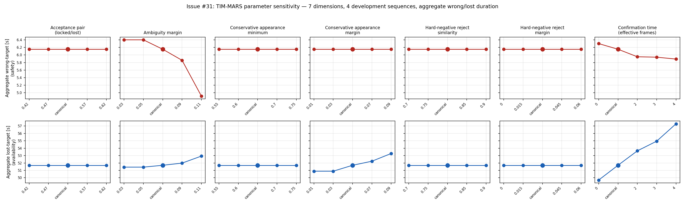
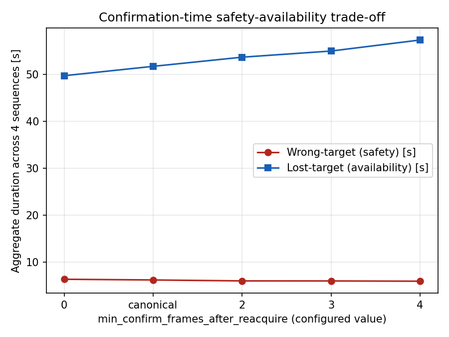

# TIM-MARS parameter sensitivity (Issue #31 / P1.13)

Status: promoted development evidence; not held out

## Purpose

Test whether the safety/correctness conclusions of the canonical TIM-MARS
configuration are robust to reasonable one-factor-at-a-time (OFAT)
perturbations of its seven main decision parameters, and characterise the
safety-availability trade-offs that emerge as each parameter becomes less or
more conservative, per
[`docs/issues/p1-13-parameter-sensitivity.md`](../../issues/p1-13-parameter-sensitivity.md).

This is a robustness/sensitivity study, not a retuning exercise. The
canonical TIM-MARS configuration remains canonical; no configuration or
matrix value was changed based on outcomes, and no interaction
(multi-dimension) configuration was added.

## Canonical links

- [Frozen protocol and manifest](../../issues/p1-13-parameter-sensitivity.md)
- [Sweep manifest](../../data/parameter_sensitivity/tim_mars_parameter_sensitivity_v1.yaml)
- [Frozen evaluation split](../../data/splits/README.md)
- [Sweep/replay/evaluation tooling](../../../tools/experiments/run_tim_parameter_sensitivity.py)
- [Aggregation script](../../../tools/analysis/aggregate_parameter_sensitivity_report.py)
- [Figure script](../../../tools/analysis/plot_parameter_sensitivity.py)
- [Copied lock file, provenance, batch logs, aggregate tables, final figures](p031_parameter_sensitivity_development/)

The originating generated report path is
`reports/p031_parameter_sensitivity_5b340c2b_2026-08-08/`.

## Execution summary

All 116 deterministic TIM replay + event-recovery evaluation cells (29
configurations x 4 development sequences) were executed with `--run
--resume`, one sequence batch at a time, against the frozen manifest and
lock committed in commit `5b340c2b`. Canonical config hash
`e9dc78c8e60d5c108e608a449803832738e39867ddd708a4d6855bbb782fe931` was
re-verified against the live file on the Pi repository after every batch and
never drifted. The raw/ByteTrack reference stream (`duration_metrics.raw_target`
and the source bag manifest recorded in each cell's provenance) is
byte-identical across all 29 configurations within every sequence, confirmed
by hashing the field across all 116 cells, not merely spot-checked.

| Sequence | Cells | Missing | Duplicated | Failed/invalid/retried |
|---|---:|---:|---:|---|
| `dev_may_hard_reentry` | 29/29 | 0 | 0 | 0 (2 cells, `baseline` and `ambiguity_margin_lower_2`, were pre-existing from an earlier smoke test and correctly resumed/skipped rather than re-executed or duplicated -- confirmed via the run's `child_commands` count, 54 = 27x2) |
| `dev_june_seq01` | 29/29 | 0 | 0 | 1 retried: first launch attempt crashed on cell 1 (`ModuleNotFoundError: rosbag2_py`) because the invoking shell did not source the ROS 2 overlay; zero cells had been written at that point, so nothing was duplicated or corrupted; the invocation was corrected and the full sequence re-run cleanly (58 = 29x2 fresh commands, 0 failures) |
| `dev_june_seq03` | 29/29 | 0 | 0 | 0 |
| `dev_june_seq04` | 29/29 | 0 | 0 | 0 |
| **Total** | **116/116** | **0** | **0** | **1 tooling retry, 0 data/evidence-affecting failures** |

The `dev_june_seq01` retry was an invocation-environment defect (missing
`source /opt/ros/jazzy/setup.bash` in a non-interactive SSH command), not a
package, data, or algorithm defect: `/opt/ros/jazzy` and the workspace
overlay were confirmed present and importable once sourced, and `dpkg`/
`unattended-upgrades` logs show no relevant package change near the failure
time.

## Per-sequence canonical baseline

| Sequence | Raw correct [s] | Raw wrong [s] | Raw lost [s] | TIM correct [s] | TIM wrong [s] | TIM lost [s] | TIM wrong ratio | TIM lost ratio |
|---|---:|---:|---:|---:|---:|---:|---:|---:|
| `dev_may_hard_reentry` | 38.283 | 7.927 | 21.490 | 62.513 | 0.100 | 5.087 | 0.0010 | 0.0750 |
| `dev_june_seq01` | 55.550 | 0.000 | 66.790 | 108.750 | 0.000 | 13.590 | 0.0000 | 0.1110 |
| `dev_june_seq03` | 12.457 | 54.020 | 29.250 | 73.892 | 6.053 | 15.782 | 0.0630 | 0.1650 |
| `dev_june_seq04` | 5.993 | 0.700 | 50.129 | 39.593 | 0.000 | 17.229 | 0.0000 | 0.3030 |

`dev_june_seq03` (the four-person crossing-ambiguity sequence) carries almost
all of the raw wrong-target duration in this development set (54.020 s of
the aggregate 62.647 s), and canonical TIM-MARS reduces it to 6.053 s. This
is relevant below: the one dimension literally named for ambiguity resolution
turns out to matter only on this sequence.

Tracked figure:
[`p031_parameter_sensitivity_development/figures/p031_all_dimensions_wrong_lost.png`](p031_parameter_sensitivity_development/figures/p031_all_dimensions_wrong_lost.png)
(regenerable from `matrix_aggregate.csv` with
`tools/analysis/plot_parameter_sensitivity.py`).

### Per-dimension aggregate trade-off (summed across all 4 development sequences)

**Acceptance pair (locked/lost)** (canonical = `0.52`)

| Value | Config ID | Wrong [s] | Lost [s] | Correct [s] | delta-wrong vs canonical [s] | delta-lost vs canonical [s] |
|---:|---|---:|---:|---:|---:|---:|
| 0.42 | `acceptance_pair_lower_2` | 6.153 | 51.688 | 284.748 | +0.000 | +0.000 |
| 0.47 | `acceptance_pair_lower_1` | 6.153 | 51.688 | 284.748 | +0.000 | +0.000 |
| 0.52 (canonical) | `baseline` | 6.153 | 51.688 | 284.748 | +0.000 | +0.000 |
| 0.57 | `acceptance_pair_higher_1` | 6.153 | 51.688 | 284.748 | +0.000 | +0.000 |
| 0.62 | `acceptance_pair_higher_2` | 6.153 | 51.688 | 284.748 | +0.000 | +0.000 |

**Ambiguity margin** (canonical = `0.07`)

| Value | Config ID | Wrong [s] | Lost [s] | Correct [s] | delta-wrong vs canonical [s] | delta-lost vs canonical [s] |
|---:|---|---:|---:|---:|---:|---:|
| 0.03 | `ambiguity_margin_lower_2` | 6.403 | 51.438 | 284.748 | +0.250 | -0.250 |
| 0.05 | `ambiguity_margin_lower_1` | 6.403 | 51.438 | 284.748 | +0.250 | -0.250 |
| 0.07 (canonical) | `baseline` | 6.153 | 51.688 | 284.748 | +0.000 | +0.000 |
| 0.09 | `ambiguity_margin_higher_1` | 5.859 | 51.982 | 284.748 | -0.294 | +0.294 |
| 0.11 | `ambiguity_margin_higher_2` | 4.909 | 52.932 | 284.748 | -1.244 | +1.244 |

**Conservative appearance minimum similarity** (canonical = `0.65`)

| Value | Config ID | Wrong [s] | Lost [s] | Correct [s] | delta-wrong vs canonical [s] | delta-lost vs canonical [s] |
|---:|---|---:|---:|---:|---:|---:|
| 0.55 | `appearance_conservative_min_similarity_lower_2` | 6.153 | 51.688 | 284.748 | +0.000 | +0.000 |
| 0.6 | `appearance_conservative_min_similarity_lower_1` | 6.153 | 51.688 | 284.748 | +0.000 | +0.000 |
| 0.65 (canonical) | `baseline` | 6.153 | 51.688 | 284.748 | +0.000 | +0.000 |
| 0.7 | `appearance_conservative_min_similarity_higher_1` | 6.153 | 51.688 | 284.748 | +0.000 | +0.000 |
| 0.75 | `appearance_conservative_min_similarity_higher_2` | 6.153 | 51.688 | 284.748 | +0.000 | +0.000 |

**Conservative appearance margin** (canonical = `0.05`)

| Value | Config ID | Wrong [s] | Lost [s] | Correct [s] | delta-wrong vs canonical [s] | delta-lost vs canonical [s] |
|---:|---|---:|---:|---:|---:|---:|
| 0.01 | `appearance_conservative_margin_lower_2` | 6.153 | 50.888 | 285.548 | +0.000 | -0.800 |
| 0.03 | `appearance_conservative_margin_lower_1` | 6.153 | 50.888 | 285.548 | +0.000 | -0.800 |
| 0.05 (canonical) | `baseline` | 6.153 | 51.688 | 284.748 | +0.000 | +0.000 |
| 0.07 | `appearance_conservative_margin_higher_1` | 6.153 | 52.238 | 284.198 | +0.000 | +0.550 |
| 0.09 | `appearance_conservative_margin_higher_2` | 6.153 | 53.288 | 283.148 | +0.000 | +1.600 |

**Hard-negative reject similarity** (canonical = `0.8`)

| Value | Config ID | Wrong [s] | Lost [s] | Correct [s] | delta-wrong vs canonical [s] | delta-lost vs canonical [s] |
|---:|---|---:|---:|---:|---:|---:|
| 0.7 | `hard_negative_reject_similarity_lower_2` | 6.153 | 51.688 | 284.748 | +0.000 | +0.000 |
| 0.75 | `hard_negative_reject_similarity_lower_1` | 6.153 | 51.688 | 284.748 | +0.000 | +0.000 |
| 0.8 (canonical) | `baseline` | 6.153 | 51.688 | 284.748 | +0.000 | +0.000 |
| 0.85 | `hard_negative_reject_similarity_higher_1` | 6.153 | 51.688 | 284.748 | +0.000 | +0.000 |
| 0.9 | `hard_negative_reject_similarity_higher_2` | 6.153 | 51.688 | 284.748 | +0.000 | +0.000 |

**Hard-negative reject margin** (canonical = `0.03`)

| Value | Config ID | Wrong [s] | Lost [s] | Correct [s] | delta-wrong vs canonical [s] | delta-lost vs canonical [s] |
|---:|---|---:|---:|---:|---:|---:|
| 0 | `hard_negative_reject_margin_lower_2` | 6.153 | 51.688 | 284.748 | +0.000 | +0.000 |
| 0.015 | `hard_negative_reject_margin_lower_1` | 6.153 | 51.688 | 284.748 | +0.000 | +0.000 |
| 0.03 (canonical) | `baseline` | 6.153 | 51.688 | 284.748 | +0.000 | +0.000 |
| 0.045 | `hard_negative_reject_margin_higher_1` | 6.153 | 51.688 | 284.748 | +0.000 | +0.000 |
| 0.06 | `hard_negative_reject_margin_higher_2` | 6.153 | 51.688 | 284.748 | +0.000 | +0.000 |

**Confirmation time (configured min_confirm_frames_after_reacquire)** (canonical = `1`)

| Value | Config ID | Wrong [s] | Lost [s] | Correct [s] | delta-wrong vs canonical [s] | delta-lost vs canonical [s] |
|---:|---|---:|---:|---:|---:|---:|
| 0 | `confirmation_time_lower_1` | 6.303 | 49.688 | 286.598 | +0.150 | -2.000 |
| 1 (canonical) | `baseline` | 6.153 | 51.688 | 284.748 | +0.000 | +0.000 |
| 2 | `confirmation_time_higher_1` | 5.953 | 53.638 | 282.998 | -0.200 | +1.950 |
| 3 | `confirmation_time_higher_2` | 5.942 | 54.949 | 281.698 | -0.211 | +3.261 |
| 4 | `confirmation_time_higher_3` | 5.892 | 57.299 | 279.398 | -0.261 | +5.611 |

Tracked figure:
[`p031_parameter_sensitivity_development/figures/p031_confirmation_time_tradeoff.png`](p031_parameter_sensitivity_development/figures/p031_confirmation_time_tradeoff.png).

## Scientific interpretation

**Four of the seven dimensions are fully robust in this development set.**
Acceptance-pair thresholds, conservative-appearance minimum similarity,
hard-negative reject similarity, and hard-negative reject margin produced
*zero* measurable change to any duration or ratio metric, on any of the 4
development sequences, at any of the 4 tested perturbation levels (16 cells
each, all byte-identical to canonical). The canonical safety/correctness
conclusion is therefore robust to reasonable OFAT perturbation of these four
parameters in this development set: no tested value in these ranges, more or
less conservative than canonical, changes the outcome at all.

**Ambiguity margin has a narrow, single-sequence, mechanism-consistent
effect.** Its entire aggregate effect (up to +/-1.244 s wrong, up to
+/-1.244 s lost at the extremes) is contributed by `dev_june_seq03`; the
other three sequences show exactly zero delta at every tested level of this
dimension. This is the sequence engineered around crossing ambiguity, and
ambiguity margin is the parameter that governs how close two candidates'
scores must be before the decision is treated as ambiguous -- the
localisation is exactly what the mechanism predicts, which is evidence this
is genuine TIM-MARS behaviour and not a replay/evaluator/tooling artifact.
The trade-off is monotonic and in the expected direction: a tighter margin
(0.03-0.05) slightly increases wrong-target time and decreases lost-target
time; a looser margin (0.09-0.11) does the opposite.

**Conservative appearance margin trades availability only, never safety.**
Across all 4 sequences and all 4 tested levels, aggregate wrong-target
duration is unchanged (6.153 s at every point, canonical included); only
lost-target duration moves, monotonically, from 50.888 s (margin 0.01-0.03)
to 53.288 s (margin 0.09). In this development set this parameter is a
safety-neutral availability dial across the tested range.

**Confirmation time is the dominant lever and the clearest trade-off.**
Aggregate lost-target duration spans 49.688 s (0 frames) to 57.299 s (4
frames) -- a 7.6 s range, by far the largest of any dimension -- while
aggregate wrong-target duration falls from 6.303 s to 5.892 s over the same
range. Requiring more consecutive confirmed frames before re-accepting a
reacquired target is consistently safer and consistently less available;
canonical (configured value 1, effective 2 frames) sits inside this
monotonic trend, not at an extremum.

**No perturbation in the tested ranges outperforms canonical outright.**
Every non-canonical point either matches canonical exactly (the four robust
dimensions) or trades safety against availability in the expected direction
(the three sensitive dimensions). No tested configuration reduces both
wrong-target and lost-target duration simultaneously relative to canonical.

## Claim boundary

This is development evidence from the same four previously inspected
sequences used throughout Issues #26/#28/#30 (`dev_may_hard_reentry`,
`dev_june_seq01`, `dev_june_seq03`, `dev_june_seq04`). It supports:

- a robustness claim for 4 of 7 decision-parameter dimensions in this
  development set, within the specific tested perturbation ranges;
- a characterised, mechanism-consistent safety-availability trade-off for
  the remaining 3 dimensions.

It does not support:

- a held-out generalisation claim (H01-H03 remain required before the final
  thesis claim is frozen);
- a claim that these OFAT results bound multi-dimension interaction effects;
- a claim that the tested perturbation ranges are exhaustive of parameter
  space beyond what the frozen manifest declares;
- a formal flight-safety guarantee;
- a claim that ambiguity margin or confirmation time are unimportant outside
  this development set -- their effect here is scenario-dependent by
  construction (OFAT on 4 fixed sequences), and a sequence that exercises a
  given mechanism more than these four might show a larger effect.

## Provenance preservation

The lock file, final-invocation run provenance, all four per-batch execution
logs, the aggregate CSV/JSON tables, and the two final figures are copied
byte-for-byte into
[`p031_parameter_sensitivity_development/`](p031_parameter_sensitivity_development/)
with `SHA256SUMS` recording the tracked-copy hashes. The two figures are
explicitly force-added (`git add -f`) past the repository's blanket
`figures/` gitignore rule, since they are promoted thesis-ready evidence
rather than disposable generated output; no other file under that ignored
directory is tracked. They remain regenerable byte-for-byte from the tracked
`matrix_aggregate.csv` with `tools/analysis/plot_parameter_sensitivity.py`.
`run_provenance.json`
in the generated report directory is overwritten by each `--run` invocation
and therefore reflects only the final sequence (`dev_june_seq04`); the
per-batch command records for all four sequences are preserved in the four
copied batch logs, not fabricated after the fact.

Historical generated files, replay bags, and the canonical YAML were not
edited or moved.
